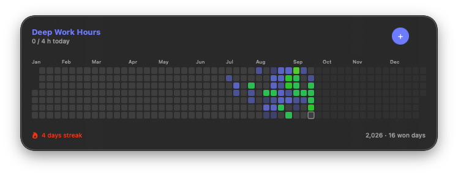
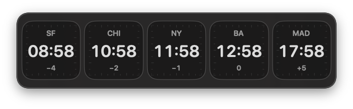
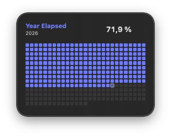
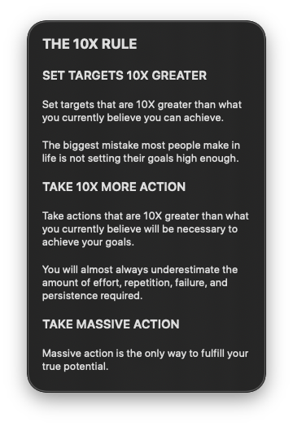

# Digital Wall

A privacy-first, native macOS vision board and deep-work tracker built with SwiftUI. It turns the desktop into a lightweight place for goals, focus hours, phrases, year progress, and world clocks without requiring an account or cloud service.

## What it looks like

The floating **Deep Work Hours** panel keeps the current day, yearly history, won days, and streak visible without opening the main app.



**World Clocks** keeps the time and offset for the places you work with in one horizontal strip.



<table>
  <tr>
    <td width="50%" valign="top">
      <strong>Year Elapsed</strong><br><br>
      A compact view of how much of the year has passed.<br><br>
      
    </td>
    <td width="50%" valign="top">
      <strong>Phrases</strong><br><br>
      Keep principles, reminders, or short Markdown notes on the desktop.<br><br>
      
    </td>
  </tr>
</table>

## Run locally

1. Open `DigitalWall.xcodeproj` in Xcode 16 or newer.
2. Copy `Config/Signing.local.xcconfig.example` to `Config/Signing.local.xcconfig`.
3. In that local file, enter your Apple development-team ID and unique reverse-domain bundle and App Group identifiers. The file is ignored by Git.
4. Register the App Group identifier for your Apple development team and enable it for the app identifier.
5. Run the **DigitalWall** scheme on **My Mac**.

## Installed app

The signed Release archive is created at `build/DigitalWall.xcarchive`. Install its `Digital Wall.app` product in `/Applications` so macOS can register the native login item from a stable location.

On its first installed launch, Digital Wall enables **Open Digital Wall at login**. Login launches are quiet: the saved desktop panels return without opening the editor or adding an icon to the Dock. This can be changed later in **Digital Wall → Settings** or in macOS **System Settings → General → Login Items & Extensions**.

## How to use it

### Track deep work

1. Open **Deep Work Hours** in the app or place its floating panel on the desktop.
2. At the end of each completed hour, click **+** on the desktop panel or **Finish hour** in the app. Choose a category, describe your activity and distractions (enter “None” if there were none), and check the daily preparation items you completed. **Deep work hour** is enabled by default to also log one hour in the tracker. Turn it off for an ordinary check-in, which is saved and synced without increasing deep work hours. The answers and hour are saved together on your Mac, even offline. Deep work is intentionally recorded in whole hours.
3. The calendar distinguishes zero-hour days from partial days. Hours one through three become progressively stronger indigo cells.
4. The fourth hour wins the day, advances the day streak, changes the calendar into its earned-color range, and launches the full-screen **DAY WON** celebration.
5. Keep logging after four hours to get distinct 5H, 6H, 7H, 8H, and evolving 9H+ celebrations. The calendar color continues progressing so an exceptional day remains visually different from a minimum win.

Use **Edit deep work** to correct or backfill a selected date. Incrementing today from that control still celebrates a newly reached milestone; historical corrections remain quiet. Reduce Motion keeps the milestone message visible while removing the large movement effects.

### Sync hour check-ins to your automation

In **Digital Wall → Settings → Webhook**, enter an HTTPS webhook URL and optional bearer token, enable sync, and save. The token is stored in macOS Keychain. **Send test** sends a `webhook.test` event with zero hours; it does not affect your tracker. Map the JSON fields in your own automation into Google Sheets or any other destination.

All pending check-ins are sent to the currently configured URL when sync is enabled. Pausing sync keeps pending check-ins on your Mac and stops new requests after the current request finishes. URL and token changes apply to the next request. Delivery runs while Digital Wall is running, resumes after restarting it, and retries when connectivity returns or the Mac wakes. Failed requests retry with a delay from 30 seconds up to 5 minutes. **Retry now** bypasses that delay. Recent check-ins and their delivery status appear in **Hour Check-ins**.

Requests use `POST`, `Content-Type: application/json`, an `Idempotency-Key` header matching `submission_id`, and `Authorization: Bearer <token>` when a token is configured. Example payload:

```json
{
  "schema_version": 2,
  "submission_id": "6BFF7538-8B20-4F76-9096-21F327B01D9F",
  "event": "hour.completed",
  "completed_at": "2026-10-03T15:00:00Z",
  "day": "2026-10-03",
  "time_zone": "America/Argentina/Buenos_Aires",
  "summary": "Finished the landing page",
  "notes": "",
  "activity": "Finished the landing page",
  "category": "Marketing",
  "is_deep_work": true,
  "distractions": "None",
  "daily_preparation": {
    "read_10x_rule": true,
    "reviewed_top_goals": true,
    "reviewed_version_of_myself": true,
    "read_motivation_list_out_loud": false,
    "read_thought_habits": true,
    "reviewed_vision_board": true
  },
  "hours": 1,
  "daily_hours": 3
}
```

`completed_at` is the original submission time in UTC; `day` is the selected form date, and `time_zone` records the local zone. `hours` is 1 for deep work and 0 for an ordinary hour. `daily_hours` is the selected day's tracker total when the form was submitted. `summary` mirrors `activity` for compatibility. Categories match the reference form: Sales, Marketing, Fulfillment, Operations, Learning, Other. All six preparation flags are included, including unchecked items. Manual tracker corrections and quick hour logging do not create webhook events. Older locally saved check-ins remain readable and deliverable, with their original summary and notes; new form fields are absent when they were not recorded.

Your automation must validate the bearer token and deduplicate on `submission_id` before appending rows. Digital Wall marks delivery successful only after an HTTP 2xx response. If an acknowledgment is lost, the same submission may arrive again with the same ID. Return 2xx after durably accepting the event; redirects are rejected to avoid forwarding private answers or tokens to another URL. HTTPS webhook URLs can themselves contain secrets, so keep your local app data private too.

Open the floating form from any app with the global **Shift-Command-H** shortcut or `digitalwall2://finish-hour`. Enable, disable, or choose another shortcut in **Settings → General**. Digital Wall must be running, including quietly at login. The form appears on the display under the pointer, above other apps and full-screen windows, with a dim backdrop on each connected display. **Tab / Shift-Tab** moves between fields; **Space** checks a focused checkbox; **Command-Return** submits; **Escape** closes it and preserves the draft. Successful submission closes the form and resets it for the next hour. The form shows today’s progress; daily preparation stays visible in two columns, with Tab navigation across each row. Deep work submissions trigger the tracker’s celebrations at 4, 5, 6, 7, 8, and later hours. Focus returns after the celebration closes. Other submissions show a brief, non-interactive confirmation. The date is always today. **Clear** resets the draft; Escape preserves it. Dismissal returns focus to the previous app. The legacy `log-deep-work-hour` and `win-deep-work-day` links now open the form too; opening a link never records an hour automatically.

Run the check-in persistence and delivery tests with `zsh Tests/run-hour-check-ins.sh`.

### Track the year

Open **Year Elapsed** in the app to see the current year’s progress, days elapsed and remaining, and the same day grid shown on the desktop. Use **Show on desktop** to show or hide its panel. The panel’s **Open Year Elapsed** action opens this section directly.

### Use the vision board

- Add images on the **Vision Boards** screen and optionally give each image a short caption.
- Choose **Fit** to show an entire image or **Fill** to crop it to its frame. Each image remembers its choice for the full board and desktop preview.
- For Fill images, use **Adjust crop** to drag the image into position, then **Save crop**. **Reset to center** restores a centered crop. The original image is preserved.
- Click an image’s **Save to Downloads** button to export a copy in its original format. Existing files are preserved.
- Use **Save all images** beside the board name to copy the selected board’s images into a new folder in Downloads, including images hidden from desktop previews.
- Click **Show board**, press **Shift-Command-V**, or click the floating vision-board panel to open the board full screen on the display under the pointer.
- Press any key or click anywhere to dismiss it.
- Create multiple boards in the app and choose which images remain visible on each floating vision-board panel.

### Arrange the desktop

- Show Deep Work Hours, Vision Boards, Phrases, Year Elapsed, or World Clocks as floating desktop panels from the app.
- Drag panels into position. They keep a small gap from one another and remember their placement.
- Hover over a panel and open its **•••** menu. **Edit** opens the corresponding editor in Digital Wall, with that phrase or board selected.
- Create phrases and vision boards, add clocks, and manage their content in the app. Desktop panels update as you edit.
- Use **Show on desktop** in Deep Work Hours, Year Elapsed, or World Clocks to show or hide its panel. These toggles stay synchronized with widget menus and remember the setting after relaunch.
- **Hide from desktop** in any widget menu hides the panel without deleting its content. Log a deep work hour directly with the panel’s **+** button.
- Global Show commands use the selected board or phrase, falling back to the first available item.

## Data and privacy

Digital Wall stores its JSON state, hour check-ins, and copied vision-board images locally in the App Group container configured in your private `Signing.local.xcconfig`. The checked-in example identifiers are placeholders and are not tied to any person or development team. Webhook sync is optional and disabled by default; when enabled, only check-in payloads are sent to your configured endpoint. It has no account system or analytics. Removing the app does not automatically remove that App Group data or its Keychain token.
